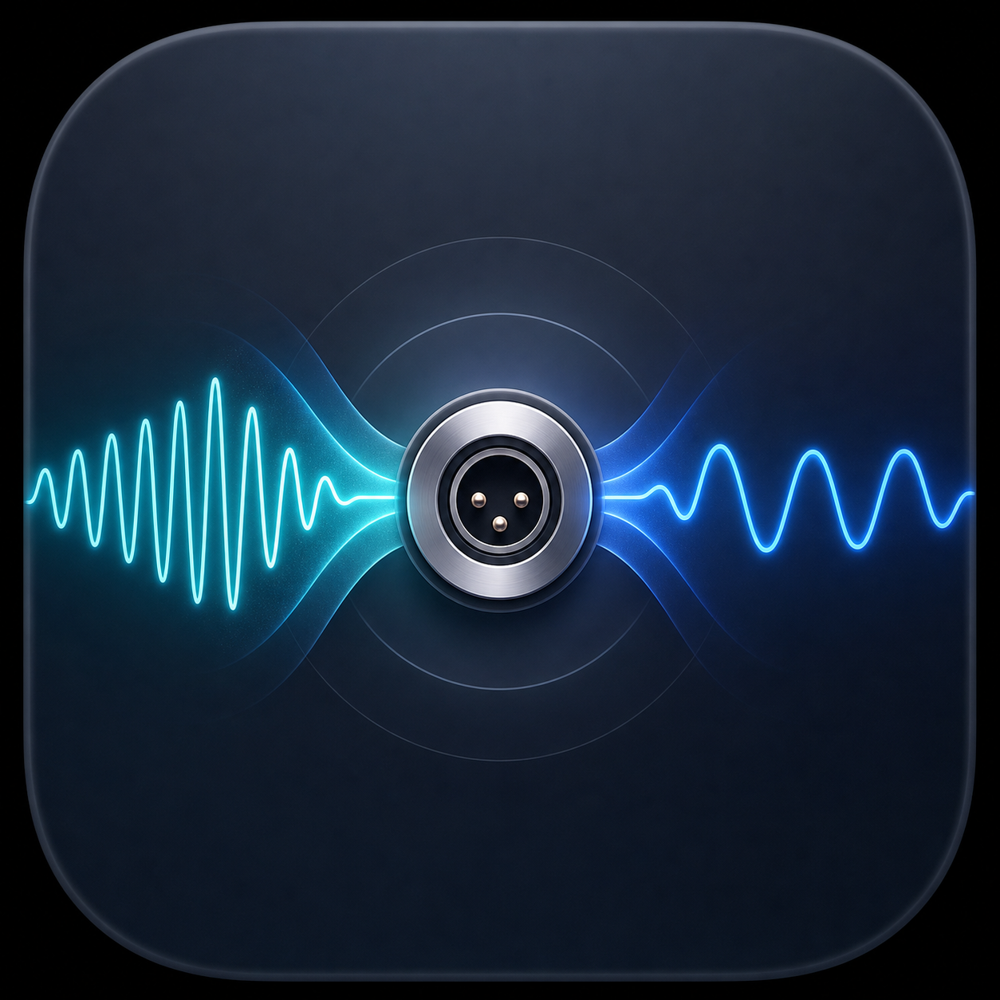

# DAC Match

一个针对 Apple Music 的 macOS 菜单栏工具：读取当前曲目的源采样率，并通过 Core Audio 自动匹配指定输出 DAC。

## 当前范围

- 每 0.4 秒检查一次 Apple Music 当前曲目和播放状态。
- 换曲时容忍 Apple Music 短暂返回不完整元数据，保持连接状态并自动等待下一次轮询补全。
- Apple Music 主快照返回 0 Hz 时会独立补读采样率并复用同曲目的有效缓存；补全前显示“—”，不把 0 Hz 当作真实音源格式。
- 每 2 秒刷新音频设备并跟随 macOS 默认输出；从菜单选择设备会真正切换系统输出。
- 主卡片与设备菜单每 0.4 秒读取 Core Audio 确认的真实默认输出和实时标称采样率，不提前显示尚未生效的目标设备。
- 菜单栏面板保持打开时会实时刷新曲目、源格式、DAC 输出和匹配状态。
- 全新状态卡片界面集中呈现专辑封面、播放状态和采样率路径。
- 支持在应用内即时切换简体中文、繁體中文和 English，并保存语言偏好。
- 面板显示 Apple Music 当前曲目的专辑封面，云端封面尚未就绪时会自动重试加载。
- DAC 切换期间会同步显示 Apple Music 的真实暂停/播放状态与当前处理阶段，封面加载不会被阻塞。
- 通过稳定时间窗口确认 DAC 格式，瞬时读数不再直接判定成功或失败。
- 偶发失败会按退避时间自动重试，并在面板中显示具体失败阶段。
- Apple Music 暂停或停止时会预匹配已选曲目，但不会擅自开始播放。
- 只在曲目变化且采样率不同时修改 DAC。
- 切换前短暂暂停 Apple Music，等待 DAC 锁定新时钟后自动恢复，避免 USB DAC 丢失音频流。
- 切换到 Sony Walkman 时会先暂停 Apple Music，确认系统路由、采样率和实际音频流后再恢复播放；若没有检测到音频流，会自动重建一次，并且不会清空流媒体当前曲目。
- WALKMAN 在同采样率换曲时也会主动刷新播放流；采样率变化后会基于稳定时钟再次打开音频流，避免界面显示播放但无声。
- 外置 DAC 变采样率时会在暂停状态下暂时释放到内置输出，待目标 DAC 空闲并锁定后再切回；“重新匹配”和“恢复声音”也会执行这套完整路由重置。
- 软件启动时若 Apple Music 已经在外置 DAC 上播放，也会执行完整接管；恢复时若采样率表面已经正确，会先切到邻近支持值再切回，强制 USB 时钟重新锁定。
- 如果播放器显示正在播放但实际静音，可使用“恢复声音”重建音频流。
- DAC 锁定等待时间可设为 0.5–5 秒，默认 2 秒以兼容 Sony Walkman 等需要较长重锁时间的设备。
- 修改等待时间后会立即允许当前曲目重新匹配；也可使用“立即重新匹配”手动重试。
- 恢复播放后再次验证实时输出采样率，避免界面误报“已匹配”。
- 只进行精确采样率匹配；设备不支持时不会擅自选择近似值。
- 不提供独占模式、DSD/DoP 或系统混音绕过。
